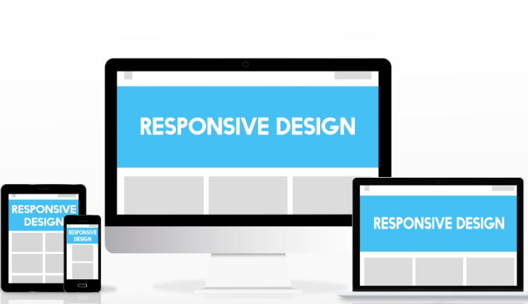
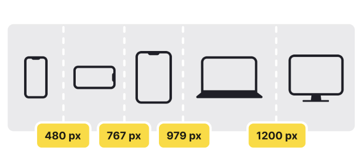
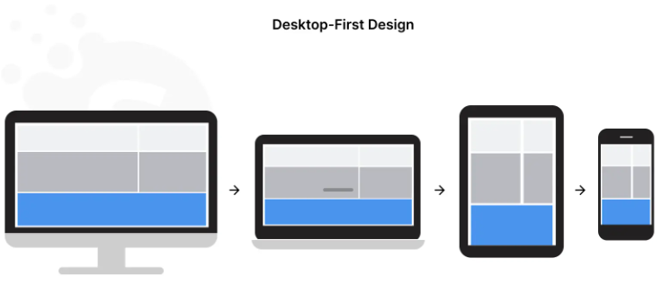
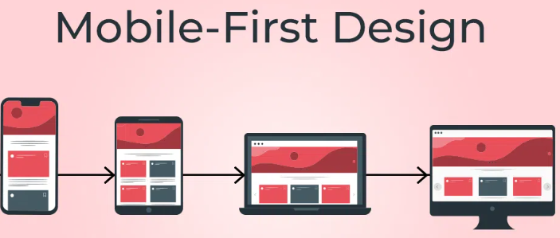

# Responsive en HTML y CSS

El diseño web responsivo se enfoca en crear sitios web que se adapten automáticamente a diferentes dispositivos y tamaños de pantalla. Esto significa que,independientemente del dispositivo que esté utilizando un usuario,el sitio web se mostrará de manera óptima y ofrecerá una experiencia de usuario satisfactoria. Para lograr esto,se utilizan técnicas como media queries,diseño fluido y elementos flexibles. Estas técnicas permiten que el contenido y el diseño del sitio web se ajusten dinámicamente según el tamaño de la pantalla del dispositivo,lo que garantiza una visualización y navegación cómodas para el usuario.



# Conceptos Clave del Diseño Web Responsivo

Los conceptos clave del diseño web responsivo se centran en crear sitios web que se adapten y funcionen bien en una amplia gama de dispositivos y tamaños de pantalla. Aquí tienes un resumen de los conceptos más importantes:

## Viewport

El viewport es esencialmente el área visible de la ventana del navegador en la pantalla del dispositivo.es el espacio donde se muestra el contenido de un sitio web dentro del navegador. Para el diseño web responsivo,el viewport es fundamental porque determina cómo se muestra y se escala el contenido en diferentes dispositivos. Para utilizar viewport de tu documento HTML,asegúrate de incluir la etiqueta meta viewport para asegurar que el navegador móvil renderice el contenido correctamente.

Ejemplo:

```html

<meta name="viewport" content="width=device-width, initial-scale=1.0">


```

## Media Query 

Las media queries son una herramienta poderosa en CSS que permite aplicar estilos específicos basados en las características del dispositivo,como el ancho de la pantalla,la altura de la pantalla,la orientación del dispositivo (horizontal o vertical),la resolución del dispositivo y otras características relacionadas con el medio de visualización.Puedes especificar reglas de estilo diferentes para diferentes rangos de anchura de pantalla.

Ejemplo:

```css

@media (max-width: 500px) {
    .box {
        background-color: pink;
    }
}

```

## Breakpoints

Los breakpoints son puntos específicos en el ancho de la pantalla donde se aplican cambios en el diseño de un sitio web utilizando media queries. Estos puntos marcan el límite en el que el diseño del sitio web necesita ajustarse para adaptarse a diferentes tamaños de pantalla y dispositivos.



## Desktop First

El enfoque "desktop-first" es una estrategia de diseño web que se centra en desarrollar primero la versión para escritorio de un sitio web,antes de considerar las optimizaciones para dispositivos móviles.




## Mobile First

el enfoque mobile-first es una estrategia de diseño web que se centra en optimizar la experiencia del usuario en dispositivos móviles como punto de partida,priorizando la simplicidad,la velocidad y la adaptabilidad progresiva del diseño. Esto resulta en sitios web más eficientes y accesibles en una amplia gama de dispositivos y tamaños de pantalla.

